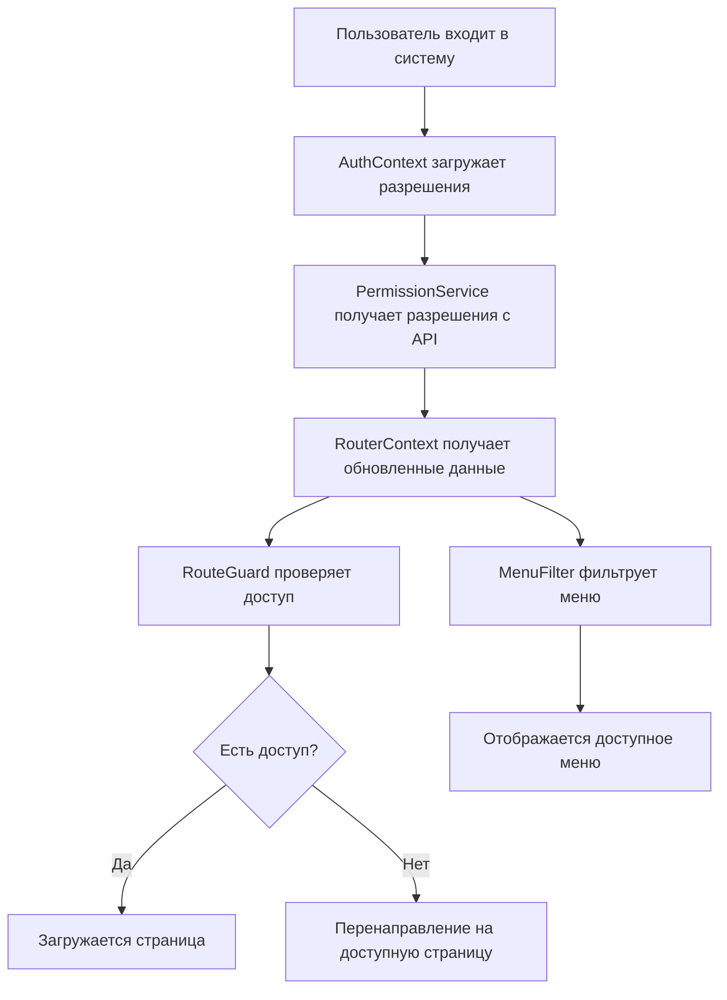
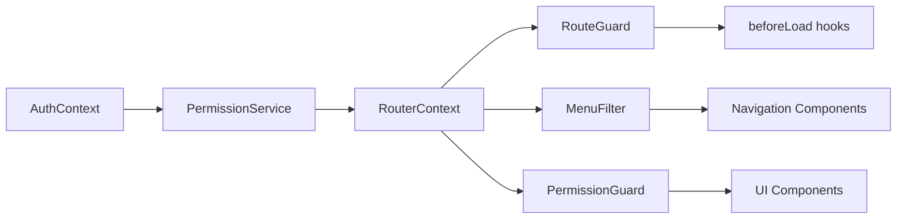

# Проектирование системы авторизации и контроля доступа в TanStack Router

## Обзор

Система RBAC (Role-Based Access Control) для TanStack Router будет построена на основе существующей архитектуры аутентификации и расширит её функциональностью управления разрешениями. Система будет использовать TypeScript для строгой типизации, контекст TanStack Router для передачи данных о разрешениях, и хуки `beforeLoad` для защиты маршрутов.

## Архитектура

### Общая архитектура системы



### Архитектура компонентов



## Компоненты и интерфейсы

### 1. Типы и интерфейсы

```typescript
// Базовые типы разрешений
type Permission = string; // например: 'dashboards:read', 'users:write'
type PermissionObject = Record<string, boolean>; // {'some-api': boolean}

// Расширенный пользователь с разрешениями
type User = {
  id: string;
  username: string;
  email: string;
  roles: string[];
  permissions: Permission[];
}

// Расширенное состояние аутентификации
type AuthState = {
  isAuthenticated: boolean;
  user: User | null;
  permissions: PermissionObject;
  login: (username: string, password: string) => Promise<void>;
  logout: () => void;
  isLoading: boolean;
  hasPermission: (permission: Permission) => boolean;
  hasAnyPermission: (permissions: Permission[]) => boolean;
  hasAllPermissions: (permissions: Permission[]) => boolean;
}

// Конфигурация маршрута с разрешениями на основе route ID
type RoutePermissionConfig = {
  routeId: string; // например: '/_authenticated/dashboards/main-dashboard'
  permissions: Permission[];
  requireAll?: boolean; // по умолчанию false (требуется любое из разрешений)
}

// Конфигурация группы маршрутов
type RouteGroupConfig = {
  groupName: string;
  routes: RouteConfig[];
}

// Конфигурация маршрута с использованием route ID вместо path
type RouteConfig = {
  routeId: string; // ID маршрута из TanStack Router
  permissions: Permission[];
  isGroup?: boolean;
  children?: RouteConfig[];
}
```

### 2. PermissionService

```typescript
type PermissionService = {
  // Получение разрешений пользователя с API
  fetchUserPermissions: (userId: string) => Promise<PermissionObject>;
  
  // Проверка разрешения
  hasPermission: (permissions: PermissionObject, permission: Permission) => boolean;
  
  // Проверка любого из разрешений
  hasAnyPermission: (permissions: PermissionObject, requiredPermissions: Permission[]) => boolean;
  
  // Проверка всех разрешений
  hasAllPermissions: (permissions: PermissionObject, requiredPermissions: Permission[]) => boolean;
  
  // Получение первого доступного маршрута используя router instance
  getFirstAccessibleRoute: (permissions: PermissionObject, router: Router) => string | null;
  
  // Получение разрешений для конкретного route ID
  getRoutePermissions: (routeId: string) => Permission[];
}
```

### 3. Расширенный AuthContext

Существующий `AuthContext` будет расширен для поддержки разрешений:

```typescript
// Расширение существующего AuthProvider
export function AuthProvider({ children }: { children: React.ReactNode }) {
  const [user, setUser] = useState<User | null>(null);
  const [permissions, setPermissions] = useState<PermissionObject>({});
  const [isAuthenticated, setIsAuthenticated] = useState(false);
  const [isLoading, setIsLoading] = useState(true);

  // Загрузка разрешений после успешной аутентификации
  const loadUserPermissions = async (userId: string) => {
    const userPermissions = await PermissionService.fetchUserPermissions(userId);
    setPermissions(userPermissions);
  };

  // Методы проверки разрешений
  const hasPermission = (permission: Permission): boolean => {
    return PermissionService.hasPermission(permissions, permission);
  };

  // ... остальные методы
}
```

### 4. RouteGuard система

```typescript
// Хук для защиты маршрутов с автоматическим получением разрешений
export const useRouteGuard = (routeId: string, requireAll = false) => {
  return ({ context, location }: { context: MyRouterContext, location: any }) => {
    const { auth } = context;
    
    if (!auth.isAuthenticated) {
      throw redirect({ to: '/login', search: { redirect: location.href } });
    }

    // Получаем разрешения для текущего маршрута из конфигурации
    const routePermissions = routePermissions[routeId] || [];
    
    if (routePermissions.length === 0) {
      // Если разрешения не требуются, разрешаем доступ
      return;
    }

    const hasAccess = requireAll 
      ? auth.hasAllPermissions(routePermissions)
      : auth.hasAnyPermission(routePermissions);

    if (!hasAccess) {
      // Получаем router instance из контекста
      const router = context.router;
      
      // Перенаправление на первый доступный маршрут
      const firstAccessibleRoute = PermissionService.getFirstAccessibleRoute(
        auth.permissions, 
        router
      );
      
      if (firstAccessibleRoute) {
        throw redirect({ to: firstAccessibleRoute });
      } else {
        throw redirect({ to: '/no-access' });
      }
    }
  };
};

// Упрощенная функция для создания beforeLoad с проверкой разрешений
export const createRouteGuard = (routeId: string, requireAll = false) => {
  return useRouteGuard(routeId, requireAll);
};
```

### 5. MenuFilter компонент

```typescript
type MenuFilterProps = {
  children: (filteredRoutes: RouteConfig[]) => React.ReactNode;
}

export const MenuFilter: React.FC<MenuFilterProps> = ({ children }) => {
  const { auth } = useRouterContext();
  const router = useRouter();
  
  // Получаем конфигурацию маршрутов динамически из router
  const routes = useMemo(() => getRouteConfigs(router), [router]);
  
  const filterRoutes = (routes: RouteConfig[]): RouteConfig[] => {
    return routes.filter(route => {
      if (route.children) {
        // Для групп: показываем если есть доступ хотя бы к одной дочерней странице
        const accessibleChildren = filterRoutes(route.children);
        return accessibleChildren.length > 0;
      } else {
        // Для отдельных маршрутов: проверяем разрешения
        return route.permissions.length === 0 || auth.hasAnyPermission(route.permissions);
      }
    }).map(route => ({
      ...route,
      children: route.children ? filterRoutes(route.children) : undefined
    }));
  };

  const filteredRoutes = useMemo(() => filterRoutes(routes), [routes, auth.permissions]);
  return <>{children(filteredRoutes)}</>;
};
```

### 6. PermissionGuard компонент

```typescript
type PermissionGuardProps = {
  permissions: Permission[];
  requireAll?: boolean;
  fallback?: React.ReactNode;
  children: React.ReactNode;
}

export const PermissionGuard: React.FC<PermissionGuardProps> = ({
  permissions,
  requireAll = false,
  fallback = null,
  children
}) => {
  const { auth } = useRouterContext();
  
  const hasAccess = requireAll 
    ? auth.hasAllPermissions(permissions)
    : auth.hasAnyPermission(permissions);

  return hasAccess ? <>{children}</> : <>{fallback}</>;
};
```

## Модели данных

### Конфигурация маршрутов

```typescript
// routes-permissions.config.ts
// Используем route ID вместо hardcoded paths
export const routePermissions: Record<string, Permission[]> = {
  // Группа dashboards
  '/_authenticated/dashboards': [],
  '/_authenticated/dashboards/main-dashboard': ['dashboards:main:read'],
  '/_authenticated/dashboards/trading-dashboard': ['dashboards:trading:read'],
  
  // Отдельные маршруты
  '/_authenticated/data-smith': ['data:read', 'data:write'],
  '/_authenticated/users': ['users:read'],
} as const;

// Динамическое получение конфигурации маршрутов из router instance
export const getRouteConfigs = (router: Router): RouteConfig[] => {
  const routes: RouteConfig[] = [];
  
  // Получаем все маршруты из router
  const allRoutes = router.routeTree.children || [];
  
  allRoutes.forEach(route => {
    const routeId = route.id;
    const permissions = routePermissions[routeId] || [];
    
    if (permissions.length > 0 || route.children) {
      routes.push({
        routeId,
        permissions,
        isGroup: !!route.children,
        children: route.children ? getChildRouteConfigs(route.children) : undefined
      });
    }
  });
  
  return routes;
};

const getChildRouteConfigs = (children: any[]): RouteConfig[] => {
  return children.map(child => ({
    routeId: child.id,
    permissions: routePermissions[child.id] || [],
    isGroup: !!child.children,
    children: child.children ? getChildRouteConfigs(child.children) : undefined
  }));
};
```

### API Response модель

```typescript
// Ответ API для получения разрешений
type PermissionsResponse = {
  userId: string;
  permissions: PermissionObject; // {'some-api': boolean}
  roles: string[];
  expiresAt: string;
}
```

## Обработка ошибок

### Стратегии обработки ошибок

1. **Ошибки загрузки разрешений**:
   - Retry механизм с экспоненциальной задержкой
   - Fallback к базовым разрешениям
   - Уведомление пользователя о проблемах

2. **Ошибки доступа к маршрутам**:
   - Перенаправление на доступные страницы
   - Логирование попыток несанкционированного доступа
   - Показ информативных сообщений

3. **Ошибки API**:
   - Graceful degradation
   - Кэширование разрешений
   - Offline режим с ограниченным функционалом

```typescript
// Обработчик ошибок разрешений
export class PermissionErrorHandler {
  static handlePermissionLoadError(error: Error, userId: string) {
    console.error('Failed to load permissions for user:', userId, error);
    
    // Возвращаем минимальные разрешения
    return {
      'basic:read': true
    };
  }

  static handleRouteAccessError(route: string, requiredPermissions: Permission[]) {
    console.warn('Access denied to route:', route, 'Required permissions:', requiredPermissions);
    
    // Логируем для аудита
    this.logAccessAttempt(route, requiredPermissions);
  }

  private static logAccessAttempt(route: string, permissions: Permission[]) {
    // Отправка в систему аудита
  }
}
```

## Стратегия тестирования

### Unit тесты

1. **PermissionService тесты**:
   - Проверка логики разрешений
   - Тестирование API вызовов
   - Проверка обработки ошибок

2. **AuthContext тесты**:
   - Тестирование состояния аутентификации
   - Проверка методов разрешений
   - Тестирование загрузки данных

3. **RouteGuard тесты**:
   - Тестирование защиты маршрутов
   - Проверка перенаправлений
   - Тестирование различных сценариев доступа

### Integration тесты

1. **Полный flow аутентификации и авторизации**
2. **Тестирование навигации с разными разрешениями**
3. **Проверка фильтрации меню**

### E2E тесты

1. **Сценарии входа пользователей с разными ролями**
2. **Проверка доступа к различным страницам**
3. **Тестирование перенаправлений**

```typescript
// Пример теста RouteGuard
describe('RouteGuard', () => {
  it('should redirect to accessible route when user lacks permissions', async () => {
    const mockAuth = {
      isAuthenticated: true,
      permissions: { 'basic:read': true },
      hasAnyPermission: vi.fn().mockReturnValue(false)
    };

    const { result } = renderHook(() => 
      useRouteGuard(['admin:write'], false)
    );

    const guardFunction = result.current;
    
    expect(() => guardFunction({ 
      context: { auth: mockAuth }, 
      location: { href: '/admin' } 
    })).toThrow();
  });
});
```

## Производительность и оптимизация

### Кэширование разрешений

```typescript
type CacheEntry = {
  permissions: PermissionObject;
  expiresAt: number;
}

type PermissionCache = {
  cache: Map<string, CacheEntry>;
  get: (userId: string) => PermissionObject | null;
  set: (userId: string, permissions: PermissionObject, ttl?: number) => void;
  clear: (userId: string) => void;
}

const createPermissionCache = (): PermissionCache => {
  const cache = new Map<string, CacheEntry>();
  
  return {
    cache,
    get: (userId: string): PermissionObject | null => {
      const cached = cache.get(userId);
      if (cached && cached.expiresAt > Date.now()) {
        return cached.permissions;
      }
      return null;
    },
    set: (userId: string, permissions: PermissionObject, ttl = 300000) => { // 5 минут
      cache.set(userId, {
        permissions,
        expiresAt: Date.now() + ttl
      });
    },
    clear: (userId: string) => {
      cache.delete(userId);
    }
  };
};
```

### Lazy loading маршрутов

- Использование code splitting для маршрутов
- Предзагрузка критических разрешений
- Оптимизация размера bundle

### Мемоизация проверок разрешений

```typescript
const memoizedPermissionCheck = useMemo(() => {
  return (permissions: Permission[]) => auth.hasAnyPermission(permissions);
}, [auth.permissions]);
```

## Безопасность

### Принципы безопасности

1. **Принцип минимальных привилегий**: Пользователи получают только необходимые разрешения
2. **Защита на уровне API**: Дублирование проверок на backend
3. **Валидация на клиенте**: Проверка целостности данных разрешений
4. **Аудит доступа**: Логирование всех попыток доступа

### Защита от атак

```typescript
// Валидация разрешений
export const validatePermissions = (permissions: unknown): PermissionObject => {
  if (!permissions || typeof permissions !== 'object') {
    throw new Error('Invalid permissions format');
  }

  const validated: PermissionObject = {};
  for (const [key, value] of Object.entries(permissions)) {
    if (typeof key === 'string' && typeof value === 'boolean') {
      validated[key] = value;
    }
  }

  return validated;
};
```

## Работа с динамическими маршрутами TanStack Router

### Проблема с hardcoded путями

TanStack Router автоматически генерирует маршруты на основе файловой структуры, что делает hardcoded пути в конфигурации неэффективными. Решение заключается в использовании route ID и динамическом получении информации о маршрутах.

### Решение через Route ID

```typescript
// Вместо hardcoded путей используем route ID
type RoutePermissionMap = Record<string, Permission[]>;

// Конфигурация разрешений привязана к route ID
export const routePermissions: RoutePermissionMap = {
  '/_authenticated/dashboards/main-dashboard': ['dashboards:main:read'],
  '/_authenticated/dashboards/trading-dashboard': ['dashboards:trading:read'],
  '/_authenticated/data-smith': ['data:read', 'data:write'],
} as const;

// Получение разрешений для маршрута
export const getRoutePermissions = (routeId: string): Permission[] => {
  return routePermissions[routeId] || [];
};
```

### Интеграция с router instance

```typescript
// Хук для получения информации о текущем маршруте
export const useCurrentRoutePermissions = (): Permission[] => {
  const router = useRouter();
  const currentRoute = router.state.location.pathname;
  
  // Находим соответствующий route ID
  const routeId = findRouteIdByPath(currentRoute, router);
  return getRoutePermissions(routeId);
};

// Функция поиска route ID по пути
const findRouteIdByPath = (path: string, router: Router): string => {
  // Логика поиска route ID в дереве маршрутов
  const findInTree = (node: any, targetPath: string): string | null => {
    if (node.fullPath === targetPath) {
      return node.id;
    }
    
    if (node.children) {
      for (const child of node.children) {
        const found = findInTree(child, targetPath);
        if (found) return found;
      }
    }
    
    return null;
  };
  
  return findInTree(router.routeTree, path) || '';
};
```

### Автоматическое обновление конфигурации

```typescript
// Хук для автоматического обновления конфигурации при изменении маршрутов
export const useRouteConfigSync = () => {
  const router = useRouter();
  
  useEffect(() => {
    // Подписываемся на изменения в router
    const unsubscribe = router.subscribe('onLoad', () => {
      // Обновляем конфигурацию разрешений при изменении маршрутов
      syncRoutePermissions(router);
    });
    
    return unsubscribe;
  }, [router]);
};

const syncRoutePermissions = (router: Router) => {
  // Проверяем новые маршруты и добавляем их в конфигурацию
  const allRoutes = getAllRouteIds(router);
  
  allRoutes.forEach(routeId => {
    if (!(routeId in routePermissions)) {
      console.warn(`Route ${routeId} не имеет настроенных разрешений`);
    }
  });
};
```

## Интеграция с существующей системой

### Миграционная стратегия

1. **Фаза 1**: Расширение существующего AuthContext
2. **Фаза 2**: Добавление RouteGuard для критических маршрутов  
3. **Фаза 3**: Внедрение MenuFilter
4. **Фаза 4**: Полное покрытие всех маршрутов

### Обратная совместимость

- Существующие маршруты без разрешений остаются доступными
- Постепенное добавление проверок разрешений
- Fallback к старой логике при ошибках

Эта архитектура обеспечивает масштабируемую, безопасную и производительную систему контроля доступа, полностью интегрированную с TanStack Router и существующей кодовой базой.