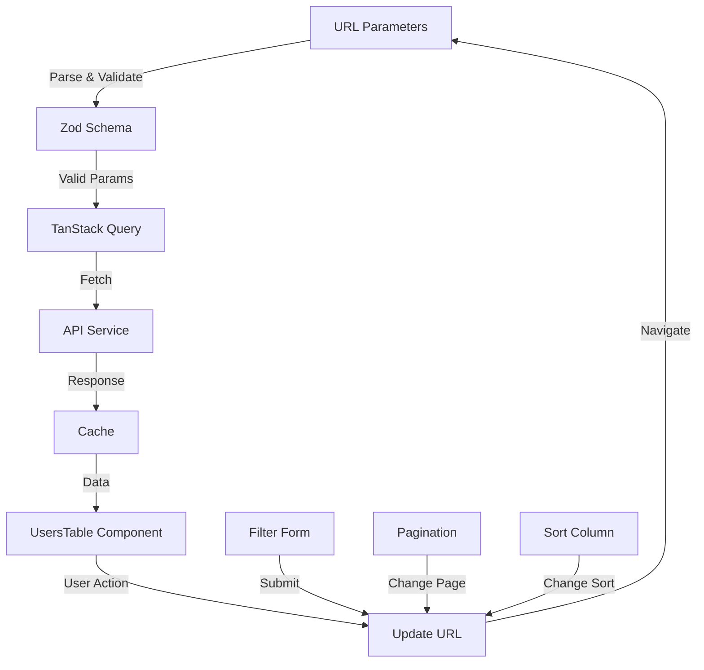
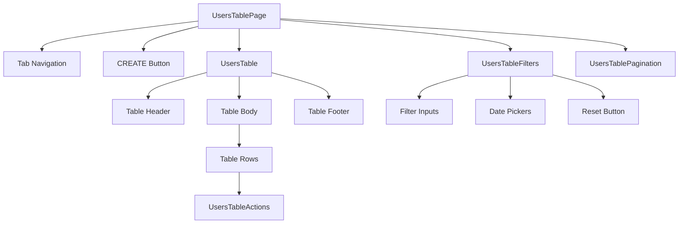

# Документ дизайна

## Обзор

Страница управления пользователями с вкладками представляет собой комплексное решение для отображения и управления данными пользователей. Архитектура построена на современном React стеке с использованием TanStack Router для маршрутизации, TanStack Query для управления серверным состоянием, TanStack Table для управления таблицей, React Hook Form с Zod для валидации форм и shadcn/ui для UI компонентов.

Основные принципы дизайна:
- Разделение ответственности между компонентами
- Типобезопасность через TypeScript и Zod
- Декларативное управление состоянием через URL параметры
- Оптимистичные обновления и кэширование данных
- Адаптивный и доступный интерфейс

## Архитектура

### Структура маршрутов

```
src/routes/$locale/_layout/
  └── users/
      ├── index.tsx          # Главная страница с вкладками (редирект на table)
      ├── table.tsx          # Вкладка с таблицей пользователей
      └── placeholder.tsx    # Вкладка-заглушка
```

### Структура компонентов

```
src/components/users/
  ├── UsersTable.tsx           # Основной компонент таблицы
  ├── UsersTableFilters.tsx    # Форма фильтрации
  ├── UsersTableColumns.tsx    # Определение колонок таблицы
  ├── UsersTablePagination.tsx # Компонент пагинации
  └── UsersTableActions.tsx    # Действия над строками
```

### Структура сервисов и хуков

```
src/hooks/api/
  └── useUsers.ts              # Хуки для работы с API пользователей

src/lib/
  └── schemas/
      └── usersSchema.ts       # Zod схемы для валидации
```

## Компоненты и интерфейсы

### 1. Маршруты (Routes)

#### users/index.tsx
Корневой маршрут, который редиректит на вкладку table по умолчанию.

```typescript
// Минимальная реализация с редиректом
export const Route = createFileRoute('/$locale/_layout/users/')({
  component: () => <Navigate to="./table" />
})
```

#### users/table.tsx
Главная страница с таблицей пользователей.

**Zod схема для search параметров:**
```typescript
const usersSearchSchema = z.object({
  page: z.number().int().positive().default(1),
  pageSize: z.number().int().positive().default(10),
  sortBy: z.string().optional(),
  sortOrder: z.enum(['asc', 'desc']).optional(),
  // Фильтры
  phone: z.string().optional(),
  id: z.string().optional(),
  email: z.string().optional(),
  firstName: z.string().optional(),
  lastName: z.string().optional(),
  registrationDateFrom: z.string().optional(),
  registrationDateTo: z.string().optional(),
  isInsider: z.enum(['Y', 'N', '']).optional(),
  country: z.string().optional(),
  domain: z.string().optional(),
  isRealAccountCreated: z.enum(['Y', 'N', '']).optional(),
  isDemoAccountCreated: z.enum(['Y', 'N', '']).optional(),
})
```

**Конфигурация маршрута:**
```typescript
export const Route = createFileRoute('/$locale/_layout/users/table')({
  validateSearch: usersSearchSchema,
  component: UsersTablePage
})
```

#### users/placeholder.tsx
Страница-заглушка для второй вкладки.

```typescript
import { Trans } from '@lingui/react/macro'

function PlaceholderPage() {
  return (
    <div className="flex items-center justify-center p-12">
      <div className="text-center">
        <h2 className="text-2xl font-semibold mb-2">
          <Trans>Страница в разработке</Trans>
        </h2>
        <p className="text-muted-foreground">
          <Trans>Эта функция скоро будет доступна</Trans>
        </p>
      </div>
    </div>
  )
}

export const Route = createFileRoute('/$locale/_layout/users/placeholder')({
  component: PlaceholderPage
})
```

### 2. Компоненты таблицы

#### UsersTable.tsx
Основной компонент таблицы, использующий TanStack Table.

**Пропсы:**
```typescript
type UsersTableProps = {
  data: User[]
  isLoading: boolean
  error: Error | null
  pagination: PaginationState
  sorting: SortingState
  onPaginationChange: (pagination: PaginationState) => void
  onSortingChange: (sorting: SortingState) => void
}
```

**Ключевые особенности:**
- Использует `useReactTable` из `@tanstack/react-table`
- Управляемая пагинация и сортировка через URL параметры
- Отображение состояний загрузки и ошибок с локализованными сообщениями
- Адаптивный дизайн с горизонтальной прокруткой на мобильных устройствах
- Кнопка "CREATE" с текстом `<Trans>Создать</Trans>`

#### UsersTableFilters.tsx
Форма фильтрации с использованием React Hook Form и Zod.

**Zod схема для формы:**
```typescript
const filterFormSchema = z.object({
  phone: z.string().optional(),
  id: z.string().optional(),
  email: z.string().email().optional().or(z.literal('')),
  firstName: z.string().optional(),
  lastName: z.string().optional(),
  registrationDateFrom: z.string().optional(),
  registrationDateTo: z.string().optional(),
  isInsider: z.enum(['Y', 'N', '']).optional(),
  country: z.string().optional(),
  domain: z.string().optional(),
  isRealAccountCreated: z.enum(['Y', 'N', '']).optional(),
  isDemoAccountCreated: z.enum(['Y', 'N', '']).optional(),
})
```

**Функциональность:**
- Использует `useForm` из `react-hook-form` с `zodResolver`
- При изменении фильтров обновляет URL параметры через `useNavigate`
- Кнопка сброса фильтров с текстом `<Trans>Сбросить</Trans>`
- Валидация в реальном времени
- Все лейблы полей должны использовать Trans для локализации
- Placeholder тексты также должны быть локализованы

**Пример поля с локализацией:**
```typescript
import { Trans, t } from '@lingui/react/macro'

<div>
  <label><Trans>Email</Trans></label>
  <Input
    {...register('email')}
    placeholder={t`Введите email`}
  />
</div>
```

#### UsersTableColumns.tsx
Определение колонок таблицы с использованием `ColumnDef` из TanStack Table.

**Колонки (все заголовки должны использовать Trans для локализации):**
1. Phone - текстовая колонка с сортировкой, заголовок: `<Trans>Телефон</Trans>`
2. ID - текстовая колонка с сортировкой, заголовок: `<Trans>ID</Trans>`
3. Email - текстовая колонка с сортировкой, отображается как ссылка, заголовок: `<Trans>Email</Trans>`
4. First Name - текстовая колонка с сортировкой, заголовок: `<Trans>Имя</Trans>`
5. Last Name - текстовая колонка с сортировкой, заголовок: `<Trans>Фамилия</Trans>`
6. Registration Date - дата с форматированием и сортировкой, заголовок: `<Trans>Дата регистрации</Trans>`
7. Is Insider - булево значение (Y/N) с сортировкой, заголовок: `<Trans>Инсайдер</Trans>`
8. Country - текстовая колонка с сортировкой, заголовок: `<Trans>Страна</Trans>`
9. Domain - текстовая колонка с сортировкой, заголовок: `<Trans>Домен</Trans>`
10. Is Real Account Created - булево значение (Y/N) с сортировкой, заголовок: `<Trans>Реальный аккаунт</Trans>`
11. Is Demo Account Created - булево значение (Y/N) с сортировкой, заголовок: `<Trans>Демо аккаунт</Trans>`
12. Options - колонка с действиями (иконки), заголовок: `<Trans>Действия</Trans>`

**Форматирование дат:**
```typescript
import { useParams } from '@tanstack/react-router'

const { locale } = useParams({ from: '/$locale/_layout/users/table' })

const formatDate = (dateString: string) => {
  return new Intl.DateTimeFormat(locale, {
    year: 'numeric',
    month: '2-digit',
    day: '2-digit',
    hour: '2-digit',
    minute: '2-digit'
  }).format(new Date(dateString))
}
```

#### UsersTablePagination.tsx
Компонент пагинации с выбором количества строк на странице.

**Функциональность:**
- Отображение текущего диапазона записей с локализацией (например, используя t макрос)
- Выбор количества строк на странице (10, 20, 50, 100)
- Кнопки навигации (первая, предыдущая, следующая, последняя страница)
- Обновление URL параметров при изменении пагинации
- Все тексты кнопок и лейблов должны использовать Trans или t макросы

**Пример локализации:**
```typescript
import { Trans, t } from '@lingui/react/macro'

<div className="flex items-center gap-2">
  <span className="text-sm text-muted-foreground">
    <Trans>Строк на странице:</Trans>
  </span>
  <Select value={pageSize.toString()} onValueChange={handlePageSizeChange}>
    {/* options */}
  </Select>
  <span className="text-sm text-muted-foreground">
    {t`${startRow}-${endRow} из ${total}`}
  </span>
</div>
```

#### UsersTableActions.tsx
Компонент с действиями для каждой строки таблицы.

**Действия:**
- Просмотр деталей пользователя
- Редактирование пользователя
- Удаление пользователя
- Дополнительные действия (в зависимости от требований)

### 3. Навигация по вкладкам

Навигация реализуется через компонент с использованием TanStack Router Link.

**Структура:**
```typescript
import { Trans } from '@lingui/react/macro'

<div className="border-b">
  <nav className="flex space-x-4">
    <Link
      to="/$locale/_layout/users/table"
      params={{ locale }}
      search={search}
      className={cn(
        "px-4 py-2 border-b-2",
        isActive ? "border-primary" : "border-transparent"
      )}
    >
      <Trans>Таблица пользователей</Trans>
    </Link>
    <Link
      to="/$locale/_layout/users/placeholder"
      params={{ locale }}
      className={cn(
        "px-4 py-2 border-b-2",
        isActive ? "border-primary" : "border-transparent"
      )}
    >
      <Trans>В разработке</Trans>
    </Link>
  </nav>
</div>
```

## Модели данных

### User Type
```typescript
type User = {
  id: string
  phone: string
  email: string
  firstName: string
  lastName: string
  registrationDate: string // ISO 8601 format
  isInsider: 'Y' | 'N'
  country: string
  domain: string
  isRealAccountCreated: 'Y' | 'N'
  isDemoAccountCreated: 'Y' | 'N'
}
```

### API Response Types
```typescript
type UsersListResponse = {
  data: User[]
  total: number
  page: number
  pageSize: number
}

type UsersListParams = {
  page: number
  pageSize: number
  sortBy?: string
  sortOrder?: 'asc' | 'desc'
  filters?: Record<string, string>
}
```

### Search Params Type
```typescript
type UsersSearchParams = z.infer<typeof usersSearchSchema>
```

## Управление данными

### TanStack Query Integration

#### useUsers Hook
```typescript
export function useUsers(params: UsersListParams) {
  return useQuery({
    queryKey: ['users', params],
    queryFn: () => fetchUsers(params),
    staleTime: 5 * 60 * 1000, // 5 минут
    gcTime: 10 * 60 * 1000, // 10 минут
  })
}
```

#### API Service
```typescript
async function fetchUsers(params: UsersListParams): Promise<UsersListResponse> {
  const searchParams = new URLSearchParams()
  searchParams.set('page', params.page.toString())
  searchParams.set('pageSize', params.pageSize.toString())
  
  if (params.sortBy) {
    searchParams.set('sortBy', params.sortBy)
    searchParams.set('sortOrder', params.sortOrder || 'asc')
  }
  
  if (params.filters) {
    Object.entries(params.filters).forEach(([key, value]) => {
      if (value) searchParams.set(key, value)
    })
  }
  
  const response = await api.get(`/users?${searchParams.toString()}`)
  return response.json()
}
```

### URL State Management

Все состояние таблицы (пагинация, сортировка, фильтры) хранится в URL параметрах:
- Позволяет делиться ссылками с конкретным состоянием таблицы
- Сохраняет состояние при навигации назад/вперед
- Упрощает синхронизацию между компонентами

**Пример URL:**
```
/ru/users/table?page=2&pageSize=20&sortBy=email&sortOrder=asc&country=Germany&isInsider=Y
```

## Обработка ошибок

### Уровни обработки ошибок

1. **Валидация на уровне формы (Zod)**
   - Валидация email формата
   - Валидация диапазонов дат
   - Валидация обязательных полей

2. **Валидация URL параметров (Zod + TanStack Router)**
   - Автоматическая валидация при навигации
   - Fallback на значения по умолчанию при невалидных параметрах

3. **Обработка ошибок API (TanStack Query)**
   - Отображение сообщений об ошибках в UI
   - Retry логика для временных сбоев
   - Кэширование успешных ответов

### Компоненты состояний

```typescript
import { Trans } from '@lingui/react/macro'

// Состояние загрузки
if (isLoading) {
  return <div className="flex justify-center p-8">
    <Loader2 className="animate-spin" />
  </div>
}

// Состояние ошибки
if (error) {
  return <Alert variant="destructive">
    <AlertTitle><Trans>Ошибка загрузки данных</Trans></AlertTitle>
    <AlertDescription>{error.message}</AlertDescription>
  </Alert>
}

// Пустое состояние
if (data.length === 0) {
  return <div className="text-center p-8 text-muted-foreground">
    <Trans>Пользователи не найдены</Trans>
  </div>
}
```

## Стратегия тестирования

### Unit Tests
- Тестирование Zod схем валидации
- Тестирование утилитарных функций (форматирование дат, фильтрация)
- Тестирование хуков (useUsers)

### Component Tests
- Тестирование рендеринга таблицы с моковыми данными
- Тестирование взаимодействия с фильтрами
- Тестирование пагинации и сортировки
- Тестирование состояний загрузки и ошибок

### Integration Tests
- Тестирование навигации между вкладками
- Тестирование синхронизации URL параметров с состоянием таблицы
- Тестирование взаимодействия формы фильтров с таблицей

## UI/UX Considerations

### Адаптивность
- Таблица с горизонтальной прокруткой на мобильных устройствах
- Скрытие менее важных колонок на маленьких экранах
- Адаптивная форма фильтров (вертикальная раскладка на мобильных)

### Доступность
- Правильные ARIA метки для всех интерактивных элементов
- Keyboard navigation для таблицы и форм
- Screen reader friendly сообщения о состоянии загрузки
- Контрастные цвета для текста и фонов

### Производительность
- Виртуализация строк для больших таблиц (опционально)
- Debounce для фильтров с текстовым вводом
- Оптимистичные обновления для действий над пользователями
- Prefetching следующей страницы при приближении к концу текущей

### Интернационализация
- Использование @lingui/macro для всех текстовых строк (Trans, t, msg)
- Форматирование дат согласно локали пользователя
- Все UI тексты должны быть обернуты в Trans или t макросы
- Поддержка локалей из параметра маршрута $locale
- Форматирование дат с использованием Intl.DateTimeFormat с текущей локалью

## Диаграммы

### Поток данных



### Структура компонентов



## Технические решения

### Почему TanStack Table?
- Мощный и гибкий API для управления таблицами
- Встроенная поддержка сортировки, фильтрации, пагинации
- Headless архитектура позволяет полный контроль над UI
- Отличная типизация TypeScript

### Почему URL State?
- Sharable links - пользователи могут делиться ссылками с конкретным состоянием
- Browser history - работает кнопка "назад"
- Server-side rendering friendly
- Единственный источник истины для состояния

### Почему React Hook Form + Zod?
- Минимальные ре-рендеры
- Отличная производительность
- Типобезопасная валидация
- Простая интеграция с TanStack Router

### Почему shadcn/ui?
- Копируемые компоненты (не библиотека)
- Полный контроль над кодом
- Отличная доступность из коробки
- Согласованный дизайн с Tailwind CSS
